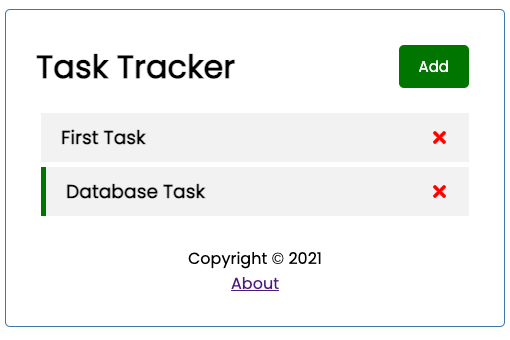

# React Task App

> A very basic React project for as a task tracker app with a reminders function. Carries a mock database and react hooks.



## Built With

- React
- Node Package Manager

## Live Demo

[Live Demo Link](https://task-tracker-ax0flrtgt-uzairali19.vercel.app/)

## Getting Started

To get a local copy up and running follow these simple example steps:

### Setupv

Download [Node.js](https://nodejs.org/en/download/).

##### Run the following commands:

For dependencies

```bash
# Install dependencies (only the first time)
npm install

# Run the local server at localhost:3000
npm run start

# Run the mock database at localhost:3004

npm run server

# Build for production in the build/ directory
npm run build
```

To test your code before pushing it to your repo:

```bash
# To check for CSS errors
npx stylelint "**/*.{css,scss}"

# To check for Javascript errors
npx eslint .
```

## Authors

👤 **Uzair Ali**

- GitHub: [@uzairali19](https://github.com/uzairali19)
- Twitter: [@uzairali751](https://twitter.com/Uzairali751)
- LinkedIn: [@uzairali19](https://www.linkedin.com/in/uzairali19/)

## 🤝 Contributing

Contributions, issues, and feature requests are welcome!

Feel free to check the [issues page](https://github.com/uzairali19/task-tracker/issues/).

## Show your support

Please give a ⭐️ if you like this project!

## 📝 License

This project is [MIT](./MIT.md) licensed.
